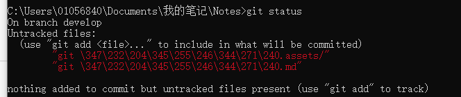
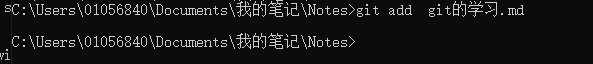
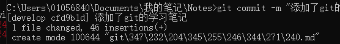

# git的学习

1.git 创建本地分支

git branch 分支名

2.git 切换分支

git checkout 分支名

3.git查看本地分支 

git branch

4 .本地创建分支后怎么推送到远程？

首先再建立一个分支features,此时远程的分支还是两个还没改变。

**step2：把本地分支push到远程**

**git push origin features**

****

# git的一般使用

### 0.查看当前状态

git status

如果新建了文件没有add的话，会如图。

### 1.git add file1 file2 ...           

​                                                            												  

没有输出！！这就对了。unix的宗旨就是*没有消息就是好消息*

### 2.git commit  -m "这里写你要添加的是什么                                    **提交文件，上面添加的一次提交就可以了** 

### 3.git push						**上传到github.com,这里会让输入账号密码**

