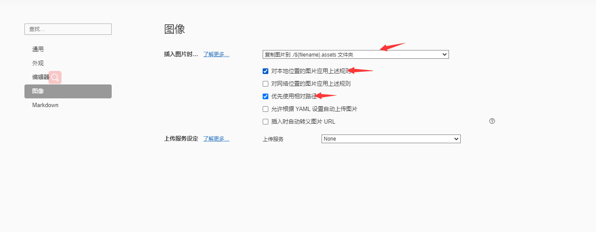
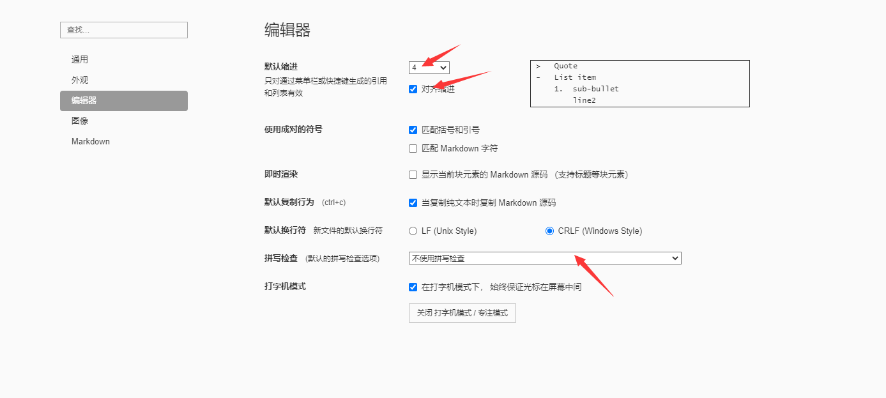

# typora的使用

## 1.标题 

标题使用”#"来实现，在标题前面加一个“#”，代表一级标题，一次类推，快捷键CTRL+数字(1-5)

代表1到5级标题。

## 2.下划线

快捷键Ctrl+u,<u>即可实现下划线功能。</u>

## 3.强调

在要强调的内容后面分别加上**两个**“*”。快捷键**Ctrl+b**

## 4.斜体

在内容前后分别加上**一个**“**”号。*快捷键Ctrl+i

*你好*

## 5.删除线

先转换为英文输入法，再把内容前后分别加上两个“~”。~~快捷键alt+shit+5~~

## 6.列表

### (1）有序列表

输入数字“1”+“."+空格，自动开始有序列表。快捷键ctrl+shift+[

### (2) 无序列表

输入"+"或"-"或"*"+空格，自动开始无序列表。快捷键ctrl+shift+]

### (3)表格

ctrl+t，在弹出的对话框中选择列数，自动生成列表。

### (4）分割线

输入三个或三个以上的"-",再按回车键就出现一条分割线

****

## 5.图片的插入

### （1）图片

​	插入本地图片：直接把图片拖入,建议把图片设置为相对路径，这样上传到其他地方，图片还可以看到了。选择偏好设置后，如图。

​	插入网络图片：快捷键ctrl+shift+i

###  (2) 链接

​	[链接提示]+(链接地址) 

  [百度](www.baidu.com)

### (3)数学公式

​	“$$"+回车
$$
a+b=c
$$

### (4）代码

行内代码：代码两端各加一个"`"号。

`java -jar test`

代码块：三个“~”按回车

~~~java
javac -jar test.jar
    hello world
    javac
    mvn
    
    
~~~

# tips：常用设置

### 设置tab为4个空格，取消拼写检查的红线，设置自动对齐。如下图。

